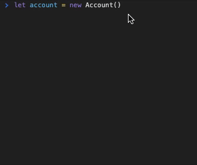
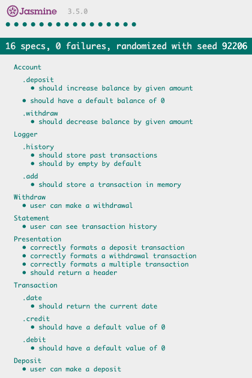
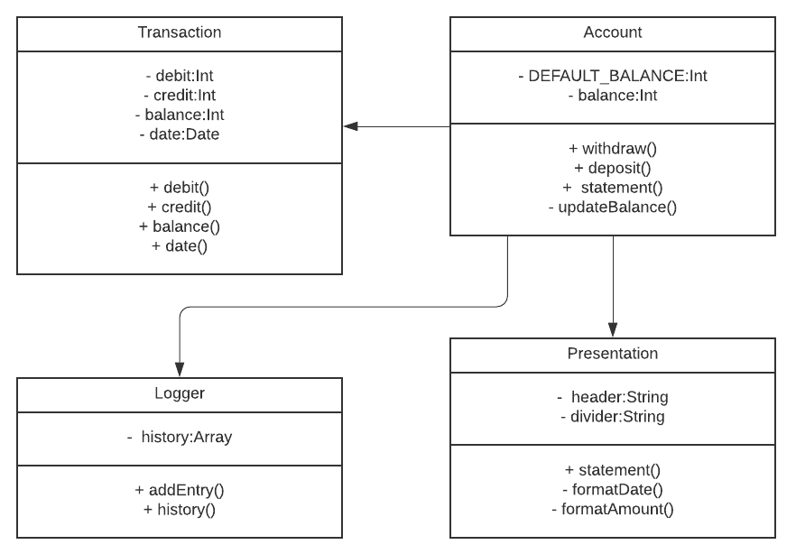

# Bank Tech Test
## Specification

### Requirements

* You should be able to interact with your code via a REPL like IRB or the JavaScript console.  (You don't need to implement a command line interface that takes input from STDIN.)
* Deposits, withdrawal.
* Account statement (date, amount, balance) printing.
* Data can be kept in memory (it doesn't need to be stored to a database or anything).

### Acceptance criteria

**Given** a client makes a deposit of 1000 on 10-01-2012  
**And** a deposit of 2000 on 13-01-2012  
**And** a withdrawal of 500 on 14-01-2012  
**When** she prints her bank statement  
**Then** she would see

```
date || credit || debit || balance
14/01/2012 || || 500.00 || 2500.00
13/01/2012 || 2000.00 || || 3000.00
10/01/2012 || 1000.00 || || 1000.00
```
## How To Use
1. Clone this repo.
2. Open browser console.
3. Set up your account
  ```js
  let account = new Account()
  ```
4. Interact with your account
  ```js
  // desposit an amount
  account.deposit(AN_AMOUNT)
  
  // withdraw an amount
  account.withdraw(AN_AMOUNT)
  
  //review transaction history
  account.statement
  ```
### Screen Preview


## Reviewing Tests
Open `SpecRunner.html` in your terminal. 
```
$ open SpecRunner.html
```
All tests should be green as shown



## Dependencies
Development:
- [Jasmine](https://jasmine.github.io/index.html) - testing framework
- [ESLint](https://eslint.org/) - Javascript linter

## Design Process

- I began the process of designing the solution by determining the different responsibilities the app would have and figuring out how to separate them into individual classes. 
- I then drew up a class diagram based on this design that detailed the parameters and methods that each class would hold. 
- From there, I was able to run "manual feature tests" for each of the apps core features in the browser console.
- Based on the error given by the feture test, individual unit tests were created.
- Using a TDD approach, each class was created separately with functionality being added incrementally.
- The app was considered complete once all unit, and hence feature, tests were passing.
- Automated feature tests were then added separately to ensure the app would still work if the current date was mocked.
- A Javascript linter was then used to ensure code quality.

### Assumptions

The requirements did not specify:

- Any error checking functionality for the user input
- Any particular currency to be used
- Any confirmation message to be displayed when a transaction is completed
- The need to prohibit a negative account balance from being created

Hence no considerations were made for these during the design process

### UML Diagram

